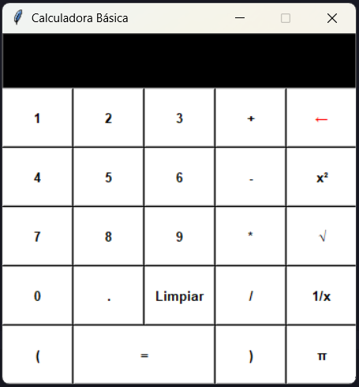

# 🧮 Calculadora Python - Clean Code & UX


> Una calculadora de escritorio robusta, diseñada aplicando **Programación Orientada a Objetos (POO)**, principios DRY y una arquitectura escalable.

---

## 📸 Demo




## 🚀 Características

Este proyecto trasciende el script básico, implementando una arquitectura de software limpia:

* **Arquitectura POO:** Código encapsulado en clases para mejor mantenimiento y escalabilidad.
* **Operaciones Básicas:** Suma, Resta, Multiplicación, División.
* **Funciones Científicas:**
    * Raíz Cuadrada (`√`).
    * Potencia al Cuadrado (`x²`).
    * Inverso Multiplicativo (`1/x`).
    * Constante PI (`π`).
* **Manejo de Errores Robusto:**
    * Sistema centralizado `try/except` para atrapar `ZeroDivisionError`, `SyntaxError` y `ValueError`.
* **Interfaz Dinámica:**
    * Generación de botones mediante bucles y estructuras de datos (Listas/Diccionarios).
    * Algoritmo de "cursor visual" para manejar botones de diferentes tamaños (Grid System).

## 🛠️ Tecnologías y Conceptos Aplicados

* **Lenguaje:** Python 3.12+
* **GUI:** Tkinter (Librería nativa).
* **Paradigma:** Programación Orientada a Objetos (Clases, Métodos, Atributos privados).
* **Algoritmos:** Lógica de renderizado de UI basada en matrices.
* **Refactorización:** Evolución de código procedural a código modular.

## 🔧 Instalación y Uso

1.  **Clonar el repositorio:**
    ```bash
    git clone [TU_LINK_DEL_REPO_AQUI]
    ```

2.  **Navegar a la carpeta:**
    ```bash
    cd [NOMBRE_DE_LA_CARPETA]
    ```

3.  **Ejecutar:**
    ```bash
    python calculadora.py
    ```

## 🧠 Lógica Destacada: Generación de UI

En lugar de declarar 20 botones manualmente, se implementó un motor de renderizado que lee una configuración:

```python
# Ejemplo de la lógica del "Cursor Visual" para el Grid
for i in range(len(lista_botones)):
    columna_visual = 0 # Cursor
    for j in range(len(lista_botones[i])):
        # ... lógica de creación del botón ...
        
        # El cursor avanza según el ancho del botón (ej: '=' avanza 4 espacios)
        columna_visual += ancho